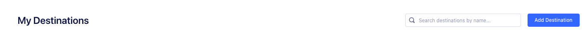
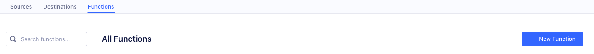
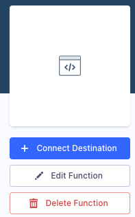
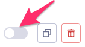
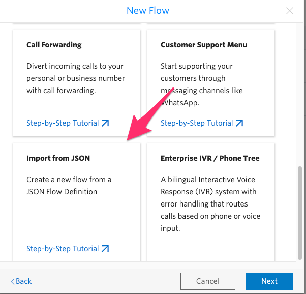

# Twilio Engage Proactive Engagement

# Table of Contents

# Solution Description

This documentation describes how to connect users with agents proactively without manual intervention, using:

* Two Segment Destination Functions
* A Studio Flow
* Twilio Content Editor

# Use Case

This solution creates a bridge between **Twilio Engage** and **Twilio Flex**, creating automated WhatsApp engagements from a User Journey on Engage depending on a pre-defined trigger. It's particularly useful for:

* Lead Conversion
* Customer Support

## Business Value

Engaging customers or leads automatically decreases the response time and therefore helps increasing lead conversion. It also saves agents time as they don't have to create conversations manually and wait for customers' replies.

# User Journey

# How to Setup

## Pre-requisites
 * A Twilio Engage account
 * A Twilio Flex account
 * An approved WhatsApp number

## Step-by-step

### WhatsApp as a Destination
1. In your Engage account, go to **Connections > Destinations** and click on **Add Destination**
   
2. Click on **Functions** and then on **New Function**
   
3. Select **Destination** as the Function Type and then click on **Build**
4. Copy the content on [destination-function-whatsapp.js](segment/destination-function-whatsapp.js) and replace the function automatically created with it
5. In the right panel, select **Settings** and add the following settings (you are going to add the values to these settings later):

| Setting Name        | Type   | Sensitive | Description                                                                                                         |
|---------------------|--------|-----------|---------------------------------------------------------------------------------------------------------------------|
| contentSid          | String | No        | The content you're going to use. You can create content [here](https://console.twilio.com/us1/develop/sms/content-editor).                                                       |
| includeTraits       | Array  | No        | The profile traits you wish to include. This is set up so you can use different placeholders as part of the content |
| messagingServiceSid | String | No        | The Messaging Service that is going to be used with Content API. You can set it up [here](https://console.twilio.com/us1/develop/sms/services). Don't forget to add a WhatsApp number to it                            |
| profilesApiToken    | String | Yes       | The Segment Profiles API token used to obtain users' traits. You can set on up by going to **Profiles > Profiles Settings > API Access** (you can use the same one for all functions described in this doc).                                |
| twilioAccountSid    | String | No        | Your Twilio Account SID. Obtainable [here](https://console.twilio.com/?frameUrl=%2Fconsole%3Fx-target-region%3Dus1).                                                                           |
| twilioAuthToken     | String | Yes       | Your Twilio Account Authentication Token. Obtainable along with the Account SID                                     |

6. With the Settings ready, you can now click on **Configure** and create a name for your Destination Function. Optionally, you can set up a description and a logo as well
7. Now that the Function is created, it's time to connect it as a destination. Click on **Connect Destination**
   
   
8. Select the data source associated your User's profile (it's going to have the same Space name as the one you used to create the API token, as the example below), and click on **Confirm Source**
   
   
9.  Fill the settings with the obtained values
10. Enable the Destination by clicking on the toggle as below:

**IMPORTANT NOTE:** Because Conversations currently works separetely from the Content API, make sure your Messaging Service has exactly **ONE** WhatsApp number.

### Conversations as a Destination

The steps to connect Conversations as a Destination are almost the same as the Destination Function described above. The differences are:

* On step 4, use [destination-function-create-conversation.js](segment/destination-function-create-conversation.js) as reference
* On step 5, these are the required settings:
  
| Setting Name     | Type   | Sensitive | Description                                                                                                                                                                                                    |
|------------------|--------|-----------|----------------------------------------------------------------------------------------------------------------------------------------------------------------------------------------------------------------|
| flowSid          | String | No        | The Studio flow to route conversations to an agent. You can create one [here](https://console.twilio.com/us1/develop/studio/flows?)                                                                                                                                    |
| timeout          | String | No        | The timeout (in seconds) for conversation closing (defaults to no timeout). It's important to define a timeout to avoid conversations getting crossed, especially in cases users can receive several messages. |
| twilioNumber     | Array  | No        | The Twilio WhatsApp number to be used. It's built as an array to support multiple numbers. Make sure it's the same one used in your Messaging Service from the previous setup.                                 |
| profilesApiToken | String | Yes       | The Segment Profiles API token used to obtain users' traits. You can set on up by going to **Profiles > Profiles Settings > API Access** (you can use the same one for all functions described in this doc).                                                                                                                           |
| twilioAccountSid | String | No        | Your Twilio Account SID. Obtainable [here](https://console.twilio.com/?frameUrl=%2Fconsole%3Fx-target-region%3Dus1).                                                                                                                                                                      |
| twilioAuthToken  | String | Yes       | Your Twilio Account Authentication Token. Obtainable along with the Account SID                                                                                                                                |

**IMPORTANT NOTE:** You can use [this sample Studio Flow](studio/sample_flow.json) as reference to create your Studio Flow. It sends a first message upon the user's reply and redirect the conversation to Flex. To import it, click on **Create New Flow** on Studio and select the option **Import from JSON**, pasting the Sample Flow there. Remember to set up the Workflow and Task Channel in the **Send to Flex** widget, as these are unique identifiers and cannot be migrated from one account to another.

